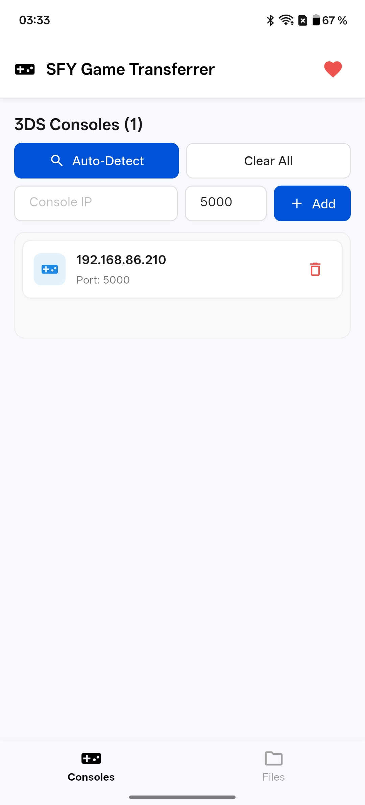
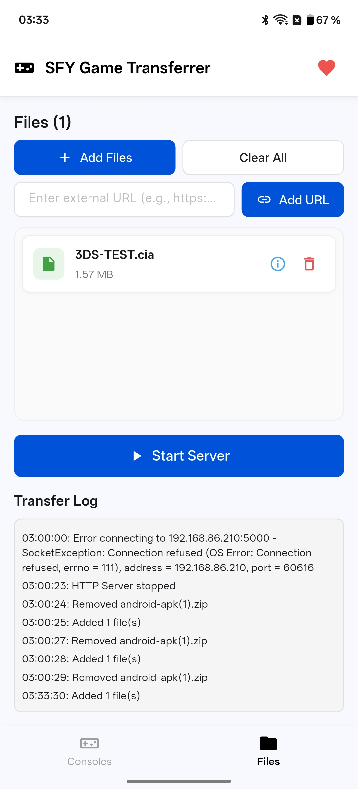

# SFY Game Transferrer

A Flutter app for transferring CIA and TIK files to Nintendo 3DS consoles using the FBI app's network receive feature.

## Features

- **Modern UI with TDesign Flutter** - Clean, intuitive interface
- **File Picker** - Select multiple .cia and .tik files from your device
- **FBI Protocol Support** - Fully compatible with FBI's "Receive URLs over the network" feature
- **Real-time Transfer Log** - Monitor the transfer process
- **File Management** - Add, view, and remove files before transfer

## Screenshots

<table>
  <tr>
    <td></td>
    <td></td>
  </tr>
  <tr>
    <td align="center">Consoles Tab</td>
    <td align="center">Files Tab</td>
  </tr>
</table>

## Requirements

1. Nintendo 3DS with FBI installed
2. 3DS and your device on the same network
3. Flutter SDK installed (for development)

## Usage

1. Open FBI on your 3DS
2. Choose "Receive URLs over the network"
3. Note the IP address and port displayed on the 3DS screen
4. Launch this app on your device
5. Enter the 3DS IP address and port
6. Tap "Add Files" to select .cia or .tik files
7. Tap "Send to 3DS" to start the transfer
8. FBI will automatically download and install the files

## How It Works

The app implements the FBI network protocol:
1. Starts an HTTP server on your device
2. Connects to the 3DS via TCP socket on the specified IP:port
3. Sends file URLs to the 3DS using FBI's protocol (4-byte length + newline-separated URLs)
4. Serves files via HTTP when the 3DS requests them

## Building

### Prerequisites

- **Flutter SDK** must be installed on your system
  - Follow the official [Flutter installation guide](https://docs.flutter.dev/get-started/install)
  - Ensure `flutter doctor` reports no issues

### Local Development

```bash
flutter pub get
flutter run
```

### GitHub Actions (Recommended for Forks)

You can build this app for all platforms using GitHub Actions without local setup:

1. **Fork this repository**
2. **Enable GitHub Actions** in your fork's settings
3. **Make one change**: In your fork's repository settings under **Actions → General**, enable **Allow GitHub Actions to create and approve pull requests**
4. **Trigger a build**: Push any change or create a pull request to automatically build for:
   - **Windows** (Windows executable)
   - **macOS** (macOS app)
   - **iOS** (iOS app)
   - **Android** (APK file)

The GitHub Actions workflow will automatically build and package the app for all platforms. Download the artifacts from the Actions tab in your repository.

## Credits

Based on the protocol implementation from [3DS FBI Link](https://github.com/smartperson/3DS-FBI-Link) by Varun Mehta.
